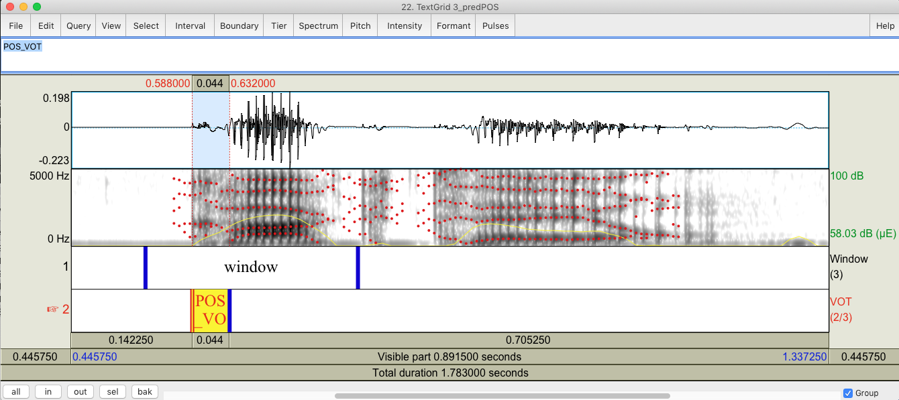
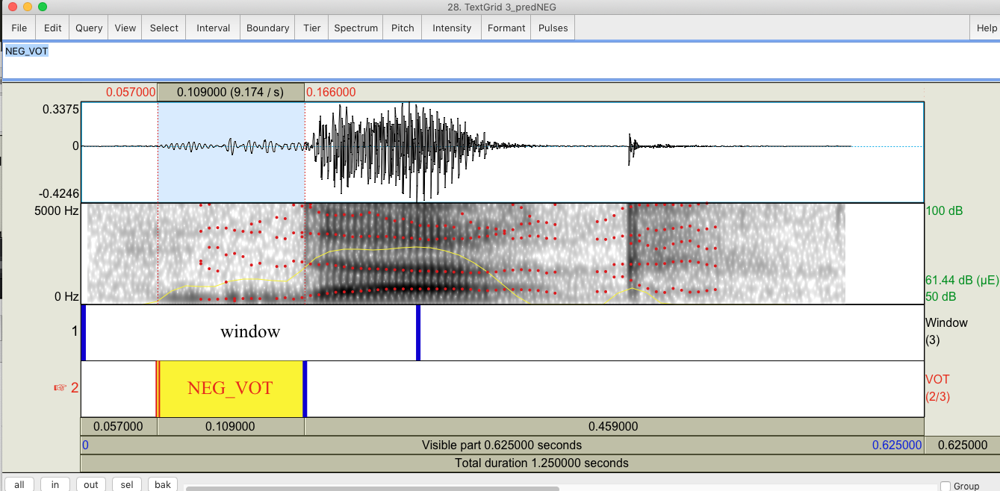
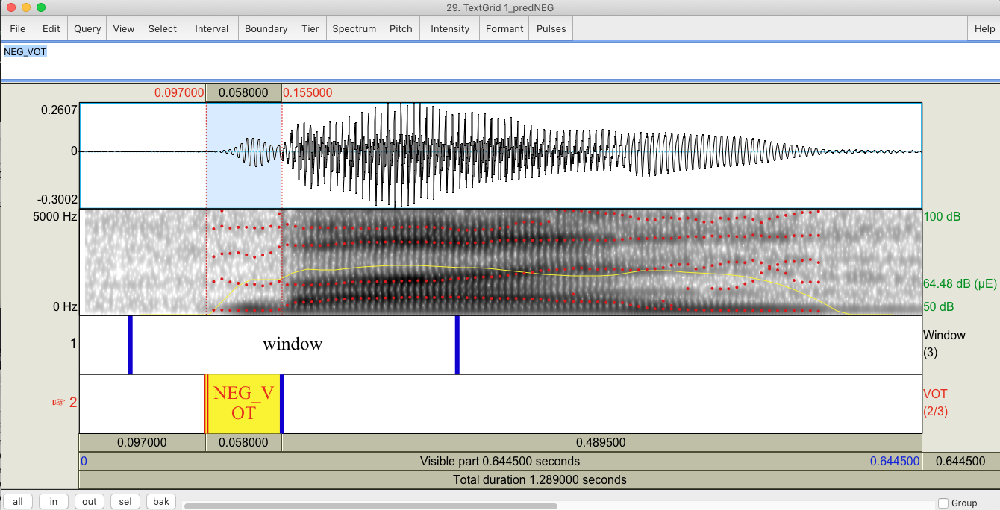

# Dr.VOT : Measuring Positive and Negative Voice Onset Time in the Wild 

Yosi Shrem (joseph.shrem@campus.technion.ac.il)\
Joseph Keshet (jkeshet@technion.ac.il)             

             

Dr.VOT is a software package for automatic measurement of voice onset time (VOT).
We propose a neural-based architecture composed of a recurrent neural network(RNN) and a structured prediction model. Dr.VOT can handle both positive and negative VOTs and is robust to variations across annotators.

This is a beta version of Dr.VOT. Any reports of bugs, comments on how to improve the software or documentation, or questions are greatly appreciated, and should be sent to the authors at the addresses given above.


 

The paper can be found at (https://arxiv.org/pdf/1910.13255.pdf). \
If you find our work useful please cite : 
```
@article{shrem2019dr,
  title={Dr. VOT: Measuring Positive and Negative Voice Onset Time in the Wild},
  author={Shrem, Yosi and Goldrick, Matthew and Keshet, Joseph},
  journal={Proc. Interspeech 2019},
  pages={629--633},
  year={2019}
}
```

------


## Installation instructions

- Python 3.6+

- Download the code:
    ```
    git clone https://github.com/MLSpeech/Dr.VOT.git
    ```
- Download Praat from: http://www.fon.hum.uva.nl/praat/ .

- Download SoX from: http://sox.sourceforge.net/ .

- Download pipenv(https://github.com/pypa/pipenv): 
    - MacOS :
    ```
    $ brew install pipenv
    ```
    - Linux :
    ```
    $ sudo apt install pipenv
    ```

- To verify everything is installed run the ```check_installations.sh``` script:
    ```
    $ ./check_installations.sh
     ```
  Note: make sure it has an execute permission. (```$ chmod +x ./check_installations.sh```)
  
  
If you encounter any problem, please check the ```log.txt```.


## How to use:

- Place your ```.wav``` files in the ```./data/raw/ ``` directory. Each file should contain a single word. \
Note:You can also place directories that contain the ```.wav``` files, the is no need to re-arrange your data. For example:
    ```
    ./data/raw
            └───dir1
            │   │   1.wav
            │   │   2.wav
            │   │   3.wav
            │               │   
            └───dir2
                │   1.wav
                │   2.wav
                │   3.wav
    ```
- Run the following script (runtime is approx. ~1sec per file):

    ```
    $ ./run_script.sh
  ```      
    Note: make sure it has an execute permission. (```$ chmod +x ./run_script.sh```)

- Thats it :) \
The predictions can be found at ```./data/out_tg/ ``` in the same hierarchy as the original data.
The classification of the VOT's type(positive/negative) was also added to each ```.TextGrid``` for convenience. \
A ```summary.csv``` file is also created for easy analysis. \
For example:
    ```
    ./data/out_tg
    |   summary.csv
    └───dir1
    │   │   1_predNEG.TextGrid
    │   │   2_predNEG.TextGrid
    │   │   3_predNEG.TextGrid
    │               
    └───dir2
        │   1_predPOS.TextGrid
        │   2_predPOS.TextGrid
        │   3_predPOS.TextGrid
    ```
  
---

## Examples
 





 
